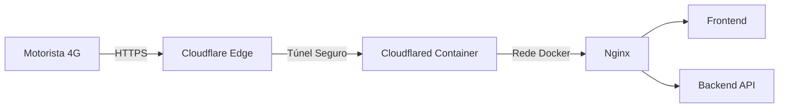

# Plano Master de Atualização V2: Acesso Externo, PWA e Sincronização Bidirecional

**Data:** 15/12/2025
**Status:** Planejamento Técnico (Validado)
**Escopo:** Frontend (Angular), Backend (Java), Infra (Docker/Cloudflare) e FileWatcher (C#).

Este documento consolida a estratégia técnica para transformar o "Organizador de Produção" em uma plataforma híbrida (Local/Remota) e implementar controle bidirecional de arquivos.

---

# 1. Acesso Externo Seguro (Cloudflare Tunnel)

Objetivo: Permitir que motoristas acessem o sistema via 4G sem expor o servidor a riscos de segurança.

### 1.1. Arquitetura
Utilizaremos a **Alternativa 1 (Cloudflare Tunnel)** por ser a mais segura (Zero Trust) e não exigir IP Fixo.

### 1.2. Implementação
1.  **Infraestrutura:**
    *   Adquirir domínio (ex: `ferreiraIntern.com.br`).
    *   Adicionar serviço `cloudflared` ao `docker-compose.yml`.
    *   Configurar token de autenticação via variável de ambiente.
2.  **Segurança:**
    *   O túnel será configurado para permitir tráfego apenas para as portas do Nginx (80).
    *   Nenhuma porta precisa ser aberta no firewall da empresa (apenas saída).

---

# 2. PWA & Geolocalização (Check-in Inteligente)

Objetivo: Melhorar a experiência móvel e automatizar a baixa de entregas.

### 2.1. Progressive Web App (PWA)
*   **Instalação:** Adicionar suporte a instalação na Home Screen (`manifest.webmanifest`).
*   **Service Worker:** Configurar cache inteligente (Assets em cache, API sempre online).

### 2.2. Feature: Check-in de Retorno
Como teremos acesso externo, usaremos **GPS (Geofencing)** como gatilho primário, com fallback para **Detecção de Rede (IP)**.

1.  **Lógica (Frontend):**
    *   Monitorar coordenadas GPS quando o app estiver em foco.
    *   Se `Distancia(Empresa) < 200m` **E** `PossuiEntregasPendentes` -> Disparar Modal.
2.  **Lógica (Fallback):**
    *   Se o GPS falhar, verificar se o IP do cliente pertence à faixa da rede local (`192.168.x.x`).

---

# 3. Sincronização Bidirecional de Arquivos (Fila de Prioridade)

Objetivo: Permitir que a renomeação de um arquivo (físico) atualize o sistema (lógico) e vice-versa.

**Status da Viabilidade:** ✅ Totalmente Viável (Código Fonte do `FileWatcherApp` foi localizado e analisado).

### 3.1. Sentido: Arquivo → Sistema (File Watcher → Java)
*   **Cenário:** Usuário renomeia `NR123_VERMELHO.dxf` para `NR123_AZUL.dxf` na pasta.
*   **Diagnóstico:** O `FileWatcherApp` (C#) já detecta o evento `Renamed` e envia para o RabbitMQ.
*   **Ação Necessária (Backend Java):**
    *   Alterar `FileWatcherService.java` para não descartar mensagens de "Pedido Existente".
    *   Adicionar lógica: "Se o pedido existe, verifique se a prioridade (cor) mudou. Se sim, atualize o banco e notifique o WebSocket."

### 3.2. Sentido: Sistema → Arquivo (Java → File Watcher)
*   **Cenário:** Usuário muda a prioridade para "AZUL" na interface web.
*   **Ação Necessária (Novo Fluxo):**
    1.  **Backend (Java):** Publicar mensagem na fila `file_commands` com payload: `{ "action": "RENAME", "target": "NR123", "newSuffix": "_AZUL" }`.
    2.  **FileWatcher (C#):**
        *   Criar novo serviço `FileCommandConsumer.cs`.
        *   Implementar lógica para localizar o arquivo original (independente da cor atual) e executar `File.Move()` para o novo nome.
        *   Tratar bloqueios de arquivo (Retry Policy) caso o arquivo esteja em uso pelo Laser.

---

# 4. Plano de Execução (Roadmap)

## Fase 1: Fundação e Acesso (Infra)
1.  Setup do Domínio e Cloudflare Tunnel.
2.  Conversão do Frontend para PWA.
3.  Deploy e Teste com 1 motorista.

## Fase 2: Inteligência de Arquivos (Backend + C#)
1.  **Java:** Implementar atualização de prioridade ao receber evento de arquivo repetido (Sentido Arquivo → Sistema).
2.  **C#:** Implementar `FileCommandConsumer` no `FileWatcherApp` (Sentido Sistema → Arquivo).
3.  **Frontend:** Adicionar seletor de prioridade na tela de "A Cortar" que aciona a API de renomeação.

## Fase 3: Automação de Retorno (Feature)
1.  Implementar serviço de Geolocalização no Angular.
2.  Criar Modal de "Bem-vindo de volta / Baixa Rápida".

---

# 5. Riscos e Mitigação

| Risco | Impacto | Mitigação |
| :--- | :--- | :--- |
| **Conflito de Arquivo** | Arquivo sendo usado pelo Laser durante renomeação. | Implementar *Retry* no C# e só permitir renomear arquivos na pasta `/laser` (fila), nunca em processamento. |
| **Instabilidade Internet** | Motorista sem acesso na rua. | O PWA cacheia a interface básica; dados sincronizam quando o sinal voltar. |
| **Segurança** | Exposição de dados. | Cloudflare Zero Trust + Autenticação JWT (já implementada) garantem blindagem. |
