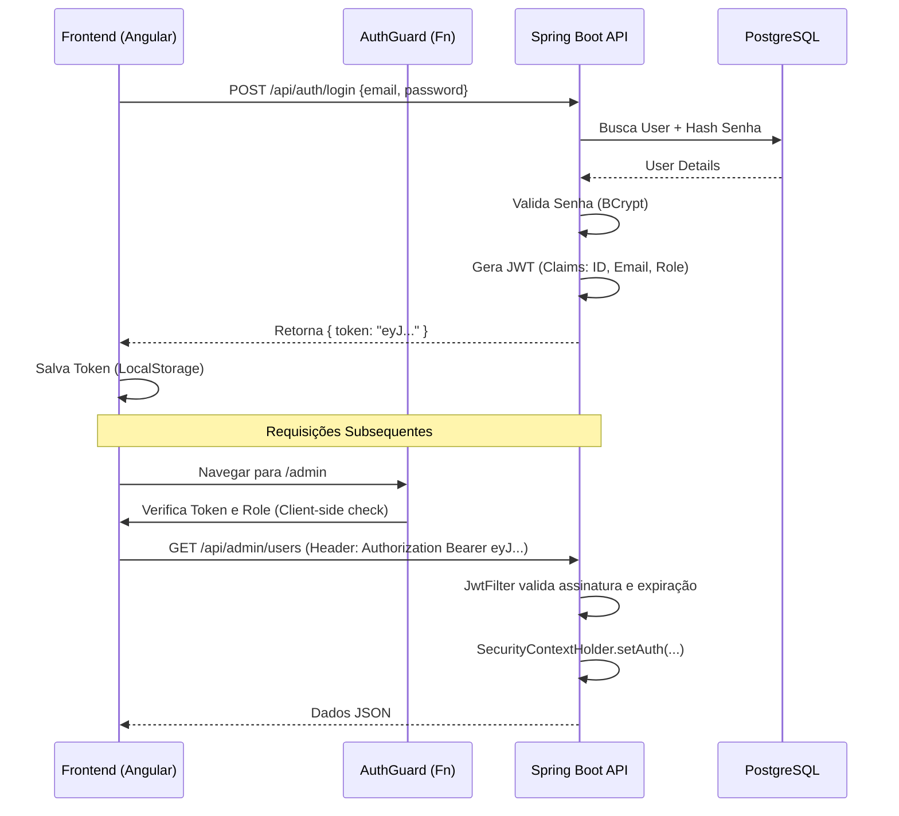

# Feature: Controle de Acesso e Identidade (Auth v1.0)

**Status:** Especificação Técnica Detalhada (Ready for Dev)
**Data Revisão:** 30/11/2025
**Versão Tecnológica:** Spring Boot 3.3+ (Security 6.3) / Angular 17+ (Standalone)

Este documento detalha o PRD (Product Requirements Document) e o SDS (System Design Specification) para a implementação de autenticação, autorização (RBAC) e rastreabilidade (Auditing) no Organizador de Produção.

---

# 1. PRD - Visão de Produto e Negócio

## 1.1. Objetivo
Substituir a identificação baseada em texto livre ("Quem é você?") por um sistema de identidade seguro e persistente. Garantir que todas as operações críticas (início de OP, finalização, entrega) sejam auditáveis e vinculadas a um usuário único.

## 1.2. Personas e Papéis (Roles)

| Role (Enum) | Descrição | Permissões Principais |
| :--- | :--- | :--- |
| **ADMIN** | Sócios, Gerentes. | CRUD total, acesso a relatórios financeiros, gestão de usuários. |
| **DESENHISTA** | Pré-impressão/CAD. | Upload de DXF, edição técnica de OPs. Sem acesso a gestão de usuários. |
| **OPERADOR** | Montadores, Emborrachadores. | Acesso ao Kanban, mover cards, visualizar detalhes técnicos. |
| **ENTREGADOR** | Logística. | Acesso apenas à lista de "Pronto para Entrega" e baixa de entregas. |

## 1.3. Requisitos Funcionais (User Stories)
1.  **Login Unificado:** Acesso via E-mail e Senha.
2.  **Sessão Persistente (Mobile):** Token com validade estendida (ex: 7 dias) ou Refresh Token para evitar logins repetitivos em tablets de produção.
3.  **Auditoria Automática:** O sistema deve preencher automaticamente `created_by` e `updated_by` sem input do usuário.
4.  **Bloqueio de Rotas:** Usuários não autorizados tentarem acessar `/admin` devem ser redirecionados ou receber "403 Forbidden".

---

# 2. SDS - Especificação Técnica (System Design)

## 2.1. Arquitetura de Segurança (Diagrama de Fluxo)

Utilizaremos **JWT (JSON Web Token)** para autenticação *stateless*.



## 2.2. Backend: Spring Boot 3.3 + Security 6.3

### 2.2.1. Dependências (`pom.xml`)
Adicionar ao `pom.xml` existente:

```xml
<!-- Segurança Core -->
<dependency>
    <groupId>org.springframework.boot</groupId>
    <artifactId>spring-boot-starter-security</artifactId>
</dependency>

<!-- JWT (JJWT versão 0.12.x - compatível com Java 17+) -->
<dependency>
    <groupId>io.jsonwebtoken</groupId>
    <artifactId>jjwt-api</artifactId>
    <version>0.12.5</version>
</dependency>
<dependency>
    <groupId>io.jsonwebtoken</groupId>
    <artifactId>jjwt-impl</artifactId>
    <version>0.12.5</version>
    <scope>runtime</scope>
</dependency>
<dependency>
    <groupId>io.jsonwebtoken</groupId>
    <artifactId>jjwt-jackson</artifactId>
    <version>0.12.5</version>
    <scope>runtime</scope>
</dependency>
```

### 2.2.2. Modelo de Dados (Entidade `User`)

```java
package git.yannynz.organizadorproducao.domain.user;

import jakarta.persistence.*;
import lombok.*;
import org.springframework.security.core.GrantedAuthority;
import org.springframework.security.core.authority.SimpleGrantedAuthority;
import org.springframework.security.core.userdetails.UserDetails;
import java.util.Collection;
import java.util.List;

@Entity
@Table(name = "users") // 'user' é palavra reservada no Postgres
@Getter @Setter @NoArgsConstructor @AllArgsConstructor @Builder
public class User implements UserDetails {

    @Id @GeneratedValue(strategy = GenerationType.IDENTITY)
    private Long id;

    @Column(nullable = false)
    private String name; // Nome exibição (ex: "João Montador")

    @Column(nullable = false, unique = true)
    private String email; // Login

    @Column(nullable = false)
    private String password; // BCrypt Hash

    @Enumerated(EnumType.STRING)
    private UserRole role;

    @Column(columnDefinition = "boolean default true")
    private boolean active = true;

    // UserDetails methods
    @Override
    public Collection<? extends GrantedAuthority> getAuthorities() {
        return List.of(new SimpleGrantedAuthority("ROLE_" + role.name()));
    }
    @Override public String getUsername() { return email; }
    @Override public boolean isAccountNonExpired() { return true; }
    @Override public boolean isAccountNonLocked() { return true; }
    @Override public boolean isCredentialsNonExpired() { return true; }
    @Override public boolean isEnabled() { return active; }
}
```

### 2.2.3. Configuração de Segurança (Lambda DSL)

Arquivo: `infra/security/SecurityConfiguration.java`

```java
@Configuration
@EnableWebSecurity
@RequiredArgsConstructor
public class SecurityConfiguration {

    private final JwtAuthenticationFilter jwtAuthFilter;
    private final AuthenticationProvider authenticationProvider;

    @Bean
    public SecurityFilterChain securityFilterChain(HttpSecurity http) throws Exception {
        http
            .csrf(AbstractHttpConfigurer::disable) // Stateless API não precisa de CSRF
            .cors(Customizer.withDefaults()) // Usa configuração de CorsConfigurationSource
            .authorizeHttpRequests(req -> req
                .requestMatchers("/api/auth/**", "/actuator/**", "/error").permitAll()
                .requestMatchers("/api/admin/**").hasRole("ADMIN")
                .requestMatchers(HttpMethod.OPTIONS, "/**").permitAll() // Pre-flight
                .anyRequest().authenticated()
            )
            .sessionManagement(session -> session.sessionCreationPolicy(SessionCreationPolicy.STATELESS))
            .authenticationProvider(authenticationProvider)
            .addFilterBefore(jwtAuthFilter, UsernamePasswordAuthenticationFilter.class);

        return http.build();
    }
    
    @Bean
    public CorsConfigurationSource corsConfigurationSource() {
        CorsConfiguration configuration = new CorsConfiguration();
        configuration.setAllowedOrigins(List.of("http://localhost:4200", "https://app.ycar.com.br")); // Ajustar com env vars
        configuration.setAllowedMethods(List.of("GET", "POST", "PUT", "DELETE", "OPTIONS", "PATCH"));
        configuration.setAllowedHeaders(List.of("*"));
        configuration.setAllowCredentials(true);
        UrlBasedCorsConfigurationSource source = new UrlBasedCorsConfigurationSource();
        source.registerCorsConfiguration("/**", configuration);
        return source;
    }
}
```

### 2.2.4. Auditoria Automática (JPA Auditing)

Para remover a necessidade de passar o usuário manualmente em cada service.

1.  **Config:**
    ```java
    @Configuration
    @EnableJpaAuditing(auditorAwareRef = "auditorProvider")
    public class JpaAuditingConfig {
        @Bean
        public AuditorAware<String> auditorProvider() {
            return new SecurityAuditorAware();
        }
    }
    ```
2.  **Implementation:**
    ```java
    public class SecurityAuditorAware implements AuditorAware<String> {
        @Override
        public Optional<String> getCurrentAuditor() {
            Authentication authentication = SecurityContextHolder.getContext().getAuthentication();
            if (authentication == null || !authentication.isAuthenticated() || authentication instanceof AnonymousAuthenticationToken) {
                return Optional.empty();
            }
            User userPrincipal = (User) authentication.getPrincipal();
            return Optional.ofNullable(userPrincipal.getName()); // Ou ID, dependendo da estratégia
        }
    }
    ```

## 2.3. Frontend: Angular 17 (Functional)

### 2.3.1. Interceptor Funcional (`auth.interceptor.ts`)
Moderno, sem necessidade de classes `@Injectable`.

```typescript
import { HttpInterceptorFn } from '@angular/common/http';
import { inject } from '@angular/core';
import { AuthService } from '../services/auth.service';

export const authInterceptor: HttpInterceptorFn = (req, next) => {
  const authService = inject(AuthService);
  const token = authService.getToken();

  if (token) {
    const cloned = req.clone({
      setHeaders: {
        Authorization: `Bearer ${token}`
      }
    });
    return next(cloned);
  }
  
  return next(req);
};
```

### 2.3.2. Registro no `app.config.ts`

```typescript
export const appConfig: ApplicationConfig = {
  providers: [
    provideRouter(routes),
    provideHttpClient(withInterceptors([authInterceptor])), // <-- AQUI
    provideAnimations()
  ]
};
```

### 2.3.3. Guard Funcional (`auth.guard.ts`)

```typescript
import { CanActivateFn, Router } from '@angular/router';
import { inject } from '@angular/core';
import { AuthService } from '../services/auth.service';

export const authGuard: CanActivateFn = (route, state) => {
  const authService = inject(AuthService);
  const router = inject(Router);

  if (authService.isAuthenticated()) {
    const requiredRole = route.data?.['role'];
    if (requiredRole && !authService.hasRole(requiredRole)) {
      // Logado mas sem permissão
      router.navigate(['/forbidden']);
      return false;
    }
    return true;
  }

  // Não logado
  router.navigate(['/login'], { queryParams: { returnUrl: state.url }});
  return false;
};
```

---

# 3. Estratégia de Migração (Flyway)

Como o banco já existe, a migração deve ser cuidadosa.

**Arquivo:** `src/main/resources/db/migration/V20251201__create_auth_tables.sql`

```sql
-- Criar tabela de usuários
CREATE TABLE users (
    id BIGSERIAL PRIMARY KEY,
    name VARCHAR(150) NOT NULL,
    email VARCHAR(150) NOT NULL UNIQUE,
    password VARCHAR(255) NOT NULL,
    role VARCHAR(50) NOT NULL,
    active BOOLEAN DEFAULT TRUE,
    created_at TIMESTAMP DEFAULT NOW(),
    updated_at TIMESTAMP DEFAULT NOW()
);

-- Inserir Admin Inicial (Senha: admin123 - DEVE SER TROCADA NO PRIMEIRO ACESSO)
-- O hash abaixo é para 'admin123' usando BCrypt
INSERT INTO users (name, email, password, role) 
VALUES ('Administrador', 'admin@ycar.com.br', '$2a$10$r.1.1.1.1.1.1.1.1.1.1.1.1.1.1.1.1.1.1.1.1.1.1.1.1.1', 'ADMIN');

-- Adicionar colunas de rastreabilidade nas tabelas principais
ALTER TABLE orders ADD COLUMN IF NOT EXISTS created_by_user_id BIGINT REFERENCES users(id);
ALTER TABLE orders ADD COLUMN IF NOT EXISTS updated_by_user_id BIGINT REFERENCES users(id);

-- (Opcional) Migrar dados legados se houver um "de/para" confiável dos nomes em texto
```

# 4. Checklist de Implementação

1.  [ ] **Backend:** Adicionar dependências `spring-security` e `jjwt`.
2.  [ ] **Backend:** Criar package `domain.user` e classes `User`, `UserRepository`.
3.  [ ] **Backend:** Implementar `JwtService` (geração e validação de token).
4.  [ ] **Backend:** Configurar `SecurityFilterChain` (liberar `/auth` e bloquear o resto).
5.  [ ] **DB:** Criar script Flyway V2025...
6.  [ ] **Frontend:** Criar componente `LoginComponent`.
7.  [ ] **Frontend:** Implementar `AuthService` (login, logout, store token).
8.  [ ] **Frontend:** Configurar `authInterceptor` e proteger rotas com `authGuard`.
9.  [ ] **Teste:** Verificar login, persistência do token e acesso negado.
verifique sempre com testes tecnicos e unitarios afim de garantir o funcionamento correto do sistema e da nova funcionalidade.
